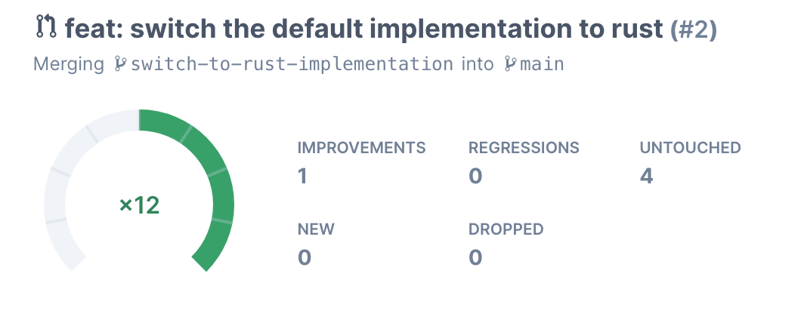

# pydot-rs

A simple DOT parser built for my talk Building native Rust modules for Python([video](https://www.youtube.com/watch?v=r2wCF5DjNJ4), [slides](https://slides.com/art049/native-rust-modules-for-python)).

This contains two implementations of the same parser, one in pure Python and one as a Rust module bound to Python using [PyO3](https://github.com/PyO3/pyo3) and [rustimport](https://github.com/mityax/rustimport).

## Running the project

### Pre-requisites:

- [Poetry](https://python-poetry.org/docs/#installation)
- A rust toolchain: It's recommended to use [rustup](https://rustup.rs/) to install it

### Dependencies

```bash
poetry install
```

### Running the tests

```bash
poetry run pytest
```

## Performance change

[The GitHub Action workflow](.github/workflows/codspeed.yml) runs benchmarks on every push to the main branch and also on every pull request using [CodSpeed](https://codspeed.io/).

[This PR](https://github.com/art049/pydot-rs/pull/2) changes the default parsing implementations from the pure Python one to the Rust one and shows the performance change between the two. More performance details can be seen directly on the [CodSpeed Dashboard](https://codspeed.io/art049/pydot-rs/branches/switch-to-rust-implementation)

[](https://codspeed.io/art049/pydot-rs/branches/switch-to-rust-implementation)
_(Note that the performance gain is a bit lesser than in the talk since the number of edges in the graph has been reduced to make the tests run faster)_

## Repository structure

```

├── pydot_rs <- the main python module
│ ├── **init**.py <- reexports from both implementations
│ ├── dot_python <- the pure python implementation
│ └── dot_rust <- the rust native module
├── samples <- some DOT graph samples
└── tests <- tests and benchmarks

```
